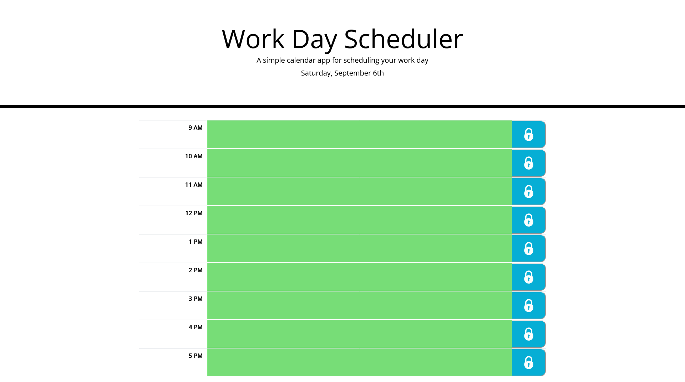

# Daily Planner

## Description

This planner takes your work day and breaks it up into each hour. Save

I built this project to get more practice with local storage as well as work with moment.js
This app solves the problem of needing to remember tasks throughout the day and puts them into an easy to use planner.
I learned how to work with moment.js as well as how to simplify javascript a little bit.

## Installation

N/A

## Usage

To use this planner, click into one of the timeblocks. You can type anything you'd like as a task for that hour. When you're finished typing, press the save icon to the right of the timeblock. This will save the data to your web browser so when you come back later, you won't loose your tasks.

[Link to deployed application](https://tuinderj.github.io/daily-planner)
